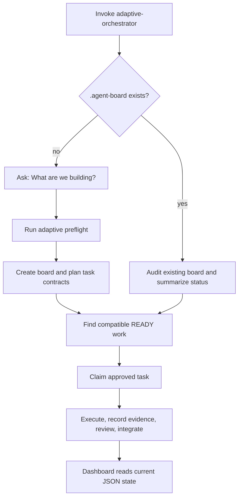

# Adaptive Orchestrator

A portable, file-based **Agent Board Protocol** for orchestrating complex multi-agent projects — goal-first preflight, planning, claiming, execution, review, integration, and a live read-only dashboard — across agent harnesses.

Agents communicate through **task contracts, artifacts, runs, reviews, decisions, and claims** written as shared `.agent-board/` JSON files, rather than fragile conversational handoffs. The board is durable shared state any agent can join, resume, or hand off mid-project.

> The self-contained skill lives in `adaptive-orchestrator/`. Install that folder in a harness-supported skill directory, invoke `adaptive-orchestrator`, and it will either bootstrap a new board or resume an existing one. The bundled scripts also work directly from a shell.

---

## Why

Multi-agent projects fail when context lives in conversation history. The Agent Board Protocol makes state explicit and portable:

- **Resumable** — any agent can pick up a board and continue where work left off, without re-reading a chat log.
- **Harness-agnostic** — works with the same protocol whether agents run under Hermes, Claude Code, OpenCode, Codex, or a human.
- **Capability-aware** — tasks specify *required capabilities*, not model names; the runtime picks the smallest/cheapest model that meets the requirement.
- **Concurrent** — task claiming is lease-based; multiple workers proceed without a central lock.
- **Auditable** — runs and reviews are append-only with unique IDs; Git provides history, transport, and worktree isolation.

---

## How it works

The board lives in a directory named `.agent-board/`:

| Path | Purpose |
|---|---|
| `.agent-board/protocol.json` | Protocol identity and version. |
| `.agent-board/project.json` | Project name, goal, phase and execution mode. |
| `.agent-board/environment/` | Verified harness capabilities, models, autonomy policy and multi-harness inventory. |
| `.agent-board/tasks/*.json` | Frozen task contracts after plan acceptance. |
| `.agent-board/claims/` | Worker leases (claim → release). |
| `.agent-board/runs/` | Append-only execution evidence and actual runtime/model. |
| `.agent-board/reviews/` | Append-only review findings (blocking vs non-blocking). |
| `.agent-board/state/` | Runtime facts that evolve during execution. |
| `.agent-board/decisions/` | Durable planning and reconciliation decisions. |
| `.agent-board/dashboard/` | Disposable HTML/JS panel; never source of truth. |

### Lifecycle

1. **Enter** — if no board exists, the skill asks “What are we building?”; otherwise it audits and summarizes the existing board.
2. **Preflight** — verify harness/model/tool capabilities and record autonomy (`autopilot`, CEO, manager or full control) plus optional multi-harness roles.
3. **Plan** — planning council: proposals → cross-review → conflict resolution → red-team; freeze when the dependency DAG is valid.
4. **Contract** — materialize portable task contracts (capabilities, deps, acceptance criteria, verification).
5. **Validate** — `validate_board.py` before any execution.
6. **Find work** — select compatible READY work for the current harness. Cross-harness work is only proposed and requires explicit human approval before takeover.
7. **Claim** — workers claim approved tasks as leases, then execute at-least-once.
8. **Execute** — code-changing work goes in an isolated Git branch/worktree; record append-only run evidence.
9. **Review** — deterministic checks first, critic if policy requires; separate blocking from non-blocking.
10. **Integrate** — accepted work merged separately; cross-task verification; reconciliation tasks for conflicts.
11. **Dashboard** — `build_dashboard.py` writes disposable assets and `serve_dashboard.py` serves a fresh, read-only JSON projection to the panel.

## How the skill works

The skill is not a central agent daemon. It is a reusable operating procedure for an agent, plus a shared JSON board and small deterministic helper scripts.



### 1. Start or resume

When invoked, the skill first looks for `.agent-board/` in the project directory.

- **No board:** it asks **“What are we building?”**, then runs preflight before planning.
- **Existing board:** it does not ask for the goal again. It validates and reads the board, reports completed work and blockers, and finds the next viable task.

This is what makes a project resumable across sessions, models, or harnesses: the project state is stored in files, not in a previous chat transcript.

### 2. Preflight decides how the agent may work

Preflight writes `environment/<runtime-id>.json`. It records only verified facts about the current harness: tools, capabilities, selectable models, autonomy policy, and optional multi-harness inventory.

Facts can be `true`, `false`, or `unknown`. An unknown fact never satisfies a task's hard requirement.

You choose one execution policy:

- **autopilot** — the agent handles ordinary execution decisions itself;
- **ask / CEO** — ask about strategy, scope, risk, and release;
- **ask / manager** — also ask about material implementation and integration trade-offs;
- **ask / full control** — ask about small execution decisions too.

`autopilot` does not override human-only blockers, risky out-of-scope actions, or cross-harness task takeover approval.

### 3. Multi-harness is shared coordination, not magic connectivity

Single-harness is the default: work is allocated among verified models available in the current harness.

For multi-harness projects, the board can describe known harnesses, their verified capabilities, and their preferred roles—for example, Codex for implementation and another harness for planning. This does not start or connect those harnesses automatically. They coordinate by opening the same project and reading the same `.agent-board/` files.

### 4. Tasks are portable contracts

Planning creates task JSON files in `.agent-board/tasks/`. A task specifies its objective, dependencies, hard requirements, acceptance criteria, and verification method.

Hard requirements decide whether a harness can perform the task. `execution.preferred_runtime` is only a preference; it never overrides missing capabilities or tools. After plan acceptance, task contracts are frozen. Runtime facts belong in state, claims, runs, and reviews instead.

### 5. Finding and claiming work

`find_work.py` selects tasks that are READY, dependency-complete, unclaimed, and compatible with the current verified environment.

It prefers work assigned to the current harness. If no such work exists but the current harness can perform a task preferred for another harness, it returns `ask_to_take_over`. The agent must explain that proposal and obtain explicit user approval before creating a claim.

A claim is a lease stored in `.agent-board/claims/`, not a global lock. It records who is working, where, and since when. Active claims block automatic selection; stale or malformed claims require reconciliation instead of silent takeover.

### 6. Execution, review, and evidence

The agent performs the task according to its contract, ideally in an isolated Git worktree for code changes. It records actual runtime/model, result, commits, and verification evidence in `.agent-board/runs/`.

Reviews are append-only records in `.agent-board/reviews/`. Tasks progress through explicit states such as `READY`, `CLAIMED`, `IN_PROGRESS`, `IN_REVIEW`, and `DONE`. A rejected review returns a task to `REVISION_REQUIRED`, rather than rewriting its original contract.

### 7. The dashboard is read-only

The dashboard is only a projection of the board:

- `build_dashboard.py` creates `dashboard/index.html` and `dashboard/app.js`;
- `serve_dashboard.py` exposes a loopback-only `/api/board` endpoint;
- the browser refreshes current task, claim, run, review, and diagnostic data from JSON files.

The dashboard never writes project state. It can be deleted and regenerated at any time; `.agent-board/` remains the single source of truth.

### Skill package versus project board

The installed `adaptive-orchestrator/` folder is reusable workflow tooling: `SKILL.md`, references, scripts, and optional UI metadata. Each real project gets its own `.agent-board/` directory containing that project's durable state.

### Concurrency invariants

- Task contracts freeze after plan acceptance; runtime facts live in `state/`, `claims/`, `runs/`, `reviews/`.
- Runs and reviews are append-only with unique IDs.
- A valid claim is required before execution; competing claims block auto-integration until reconciled.
- Git is for history, transport, audit, and worktree isolation — never a distributed lock manager.
- No exactly-once execution is promised; duplicate/conflicting evidence is preserved.

---

## Quick start

```bash
# Run these from adaptive-orchestrator/
cd adaptive-orchestrator

# Initialize a board and persist verified preflight facts
python3 scripts/init_board.py --name "Project" --goal "Goal" --autonomy autopilot
python3 scripts/record_preflight.py --json '{"runtime_id":"local","harness":"Local","capabilities":{},"tools":[],"models":[],"autonomy":{"mode":"autopilot"},"multi_harness":{"enabled":false,"harnesses":[]}}'

# Validate the board before doing anything
python3 scripts/validate_board.py

# Find compatible work. `ask_to_take_over` requires user approval.
python3 scripts/find_work.py --runtime local

# Claim first, then mark a heartbeat only for that existing claim.
python3 scripts/claim_task.py TASK-0001 --runtime R --worker W
python3 scripts/claim_task.py TASK-0001 --runtime R --worker W --heartbeat

# Release after review, transition state, record evidence
python3 scripts/release_task.py TASK-0001 --runtime R
python3 scripts/transition_task.py TASK-0001 IN_PROGRESS --runtime R
python3 scripts/record_run.py TASK-0001 --runtime R --worker W --summary "..."

# Create and view the live, read-only dashboard
python3 scripts/build_dashboard.py
python3 scripts/serve_dashboard.py --board .agent-board
```

---

## Repository layout

```
adaptive-orchestrator/
├── SKILL.md                    # Protocol overview + operating manual
├── agents/
│   └── openai.yaml             # Optional Codex/ChatGPT UI metadata
├── references/                 # Detailed protocol guides
│   ├── claiming.md             #   Lease semantics
│   ├── execution.md            #   Append-only execution evidence
│   ├── git-protocol.md         #   Branch/worktree isolation
│   ├── integration.md          #   Cross-task reconciliation
│   ├── model-selection.md      #   Capability-aware model choice
│   ├── planning.md             #   Planning council + red-team
│   ├── preflight.md            #   Capability verification
│   ├── protocol.md             #   Board layout & state semantics
│   ├── reviewing.md            #   Deterministic checks + critic
│   ├── task-contract.md        #   Portable task contract format
│   └── schemas/                #   JSON schemas for board artifacts
│       ├── claim.schema.json
│       ├── environment.schema.json
│       ├── project.schema.json
│       ├── review.schema.json
│       ├── run.schema.json
│       ├── state.schema.json
│       └── task.schema.json
├── scripts/                    # Reference CLI (Python stdlib, no deps)
│   ├── init_board.py
│   ├── record_preflight.py
│   ├── validate_board.py
│   ├── find_work.py
│   ├── list_ready_tasks.py
│   ├── claim_task.py
│   ├── release_task.py
│   ├── transition_task.py
│   ├── record_run.py
│   ├── build_dashboard.py
│   ├── serve_dashboard.py
│   └── boardlib.py             # Shared board operations
└── tests/                      # Regression coverage for the bundled tools
```

---

## Requirements

- Python 3.8+ (standard library only — no third-party dependencies)
- Git is recommended for isolated code-changing work; a remote is optional

---

## License

MIT — see [LICENSE](LICENSE).
